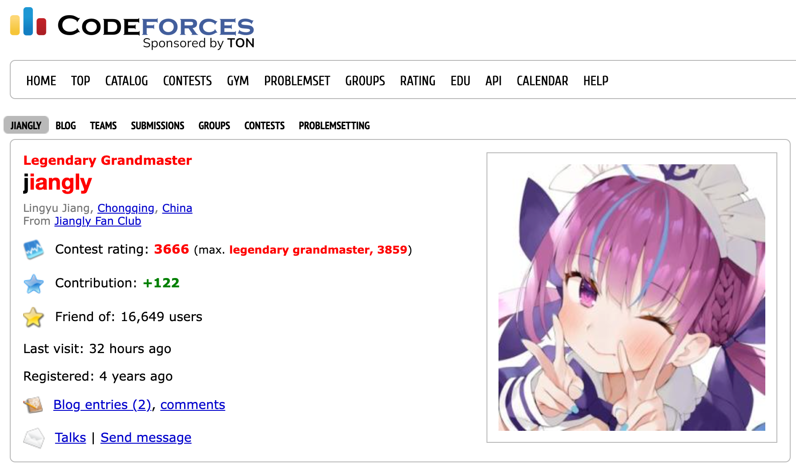
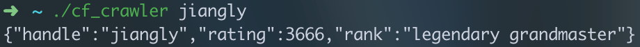
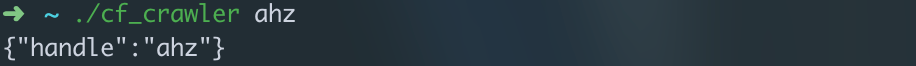
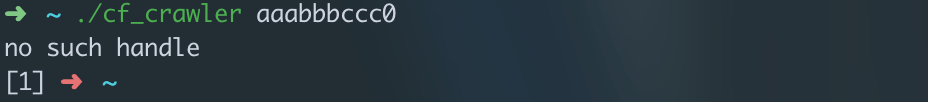

# M1.1

## 任务描述

Codeforces（https://codeforces.com）是全球知名电子竞技平台，现在 bLue 想让你帮助他搜寻感兴趣的选手的信息。

在 Codeforces 中，你可以通过点击带颜色的用户名进入其个人主页，用户名在 CF 中被称为 handle。如 handle 为 `jiangly` 的用户（<https://codeforces.com/profile/jiangly>）的个人主页如下图所示：



对于这个任务，你需要根据 bLue 请求的 handle，返回对应用户的基本数据。

## 任务要求

你需要实现一个爬虫程序，语言不限，通过命令行运行。接收的第一个参数为 handle，不会包含空格。之后进行查询。

如果对应信息可以查询到，则将查询到的数据以 JSON 形式通过 stdout 输出，并返回 `0`。JSON 的格式化方式不限，只要是合法的 JSON 字符串即可。

如果用户不存在，则通过 stderr 输出 `no such handle`，并返回 `1`。

## 输出数据结构

对于有 rating 的用户，输出对象的结构定义为：

```typescript
{
  handle: string;
  rating: number;
  rank: string;
}
```

对于无 rating 的用户，输出对象的结构定义为：

```typescript
{
  handle: string;
}
```

## 运行效果示例





## 建议完成用时

零基础 2-3 天，有基础 HTTP 或爬虫经验推荐 0.5-1 天。

## 自学参考资料关键词

- HTTP
- JSON

## 总结回顾检查点

1. 爬虫是什么？
2. HTTP 协议的基本原理规范你大概了解了吗？
3. 你能想到几种不同的爬取这道题所需信息的方式？它们分别有什么特点？

## 进阶思考题

1. 如果允许传入多个 handle，如 `./cf_crawler jiangly tourist`，你会如何实现以及如何设计输出的数据结构和返回码呢？
