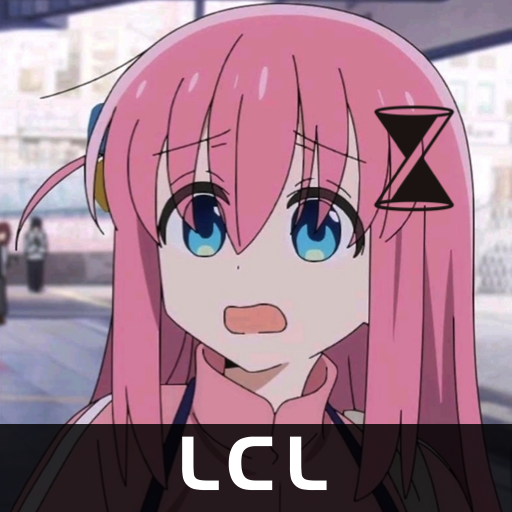
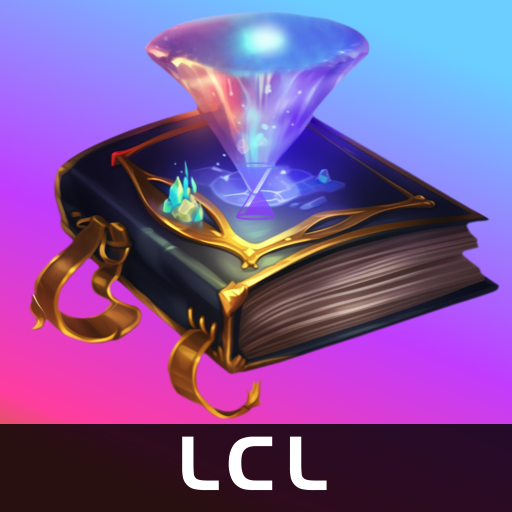

# 意义不明展览馆

## 时间切片展览馆

> 在时间森林的正中央，时之沙雕像正前方的巨大展览馆。
>
> 来参观的魔法使们无不为此惊叹：时间切片拥有极高的真实度，在进入切片后，人们通常无法分辨虚拟和现实，甚至在历史的构像中迷失自我。

- `2023-06-11`：在某位上古长者造访奇点之畔后，新的名称被决定，光锥实验室被写入了世界树。
- `2023-07-01`：《光之魔法书》首次以超文本拟态形式在元素脉络中出现。这极大方便了魔法使们的学习。

## 群头像展览馆

> 存在于世界树最不起眼根系上的一个节点。由执掌欢愉的大魔法使构建，仅用于存各种乐子。
>
> 其中序号为 0 的展馆就是这里，陈列光锥实验室历史群头像的地方。

:::tip 👉🏻 一个显眼的公告牌 👈🏻
如果想为实验室更换新头像，请联络实验室负责人。
:::

---

|                                      <!-- -->                                      |                                      <!-- -->                                      |                                      <!-- -->                                      |                                      <!-- -->                                      |
| :--------------------------------------------------------------------------------: | :--------------------------------------------------------------------------------: | :--------------------------------------------------------------------------------: | :--------------------------------------------------------------------------------: |
| 
#1 2023-06-28
 | 
#2 2023-06-29
 | 
#3 2023-06-30
 | 
#4 2023-07-01
 |
| 
#5 2023-07-02
 | 
#6 2023-07-03
 |                                                                                    |                                                                                    |

